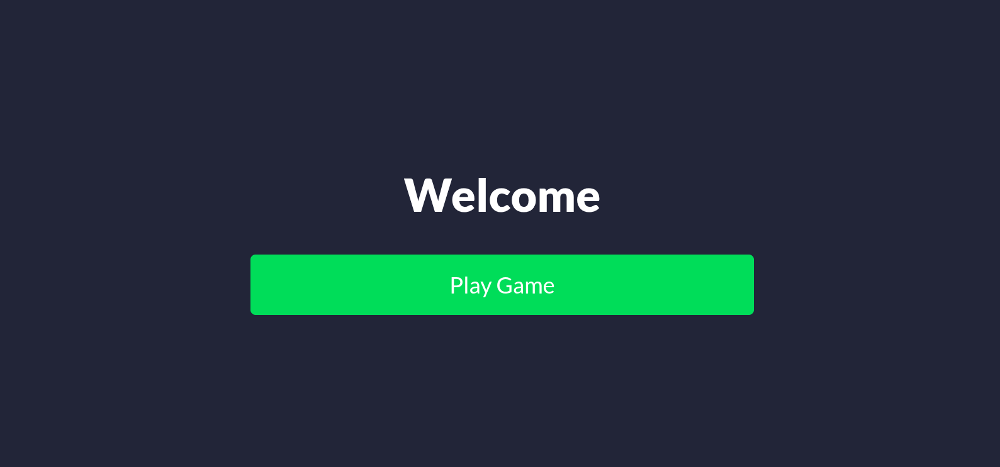
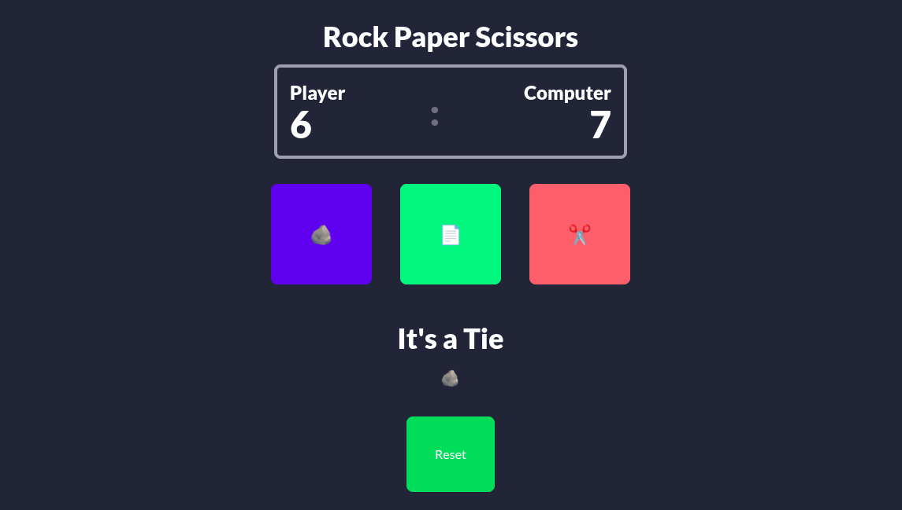

# 🪨📄✂️ Rock Paper Scissors Game

A classic Rock, Paper, Scissors game built with React and styled using Tailwind CSS. This project was developed as a hands-on learning experience, focusing on React state management, component-based architecture, and utility-first CSS principles.

## ✨ Features

*   **Player vs. Computer:** Challenge the computer in a game of Rock, Paper, Scissors.
*   **Interactive Choices:** Select your move using visually appealing emoji buttons.
*   **Dynamic Scoreboard:** Tracks player and computer scores.
*   **Real-time Results:** Displays round outcomes ("You Win!", "You Lose!", "It's a Tie!").
*   **Game Reset:** Easily reset scores and game state to play again.
*   **Intro Screen:** A welcoming introduction page before starting the game.
*   **Responsive Design:** Built with Tailwind CSS for a clean and adaptable UI.

---

### Welcome Screen



### Game Interface



---

## 🚀 Technologies Used

*   **React:** A JavaScript library for building user interfaces.
*   **Vite:** A fast build tool for modern web projects.
*   **Tailwind CSS:** A utility-first CSS framework for rapid UI development.

## 📦 Getting Started

Follow these steps to get the project up and running on your local machine.

### Prerequisites

Make sure you have Node.js and npm (Node Package Manager) installed.

### Installation

1.  **Clone the repository:**
    ```bash
    git clone <your-repo-url>
    cd RPS-Game
    ```
2.  **Install dependencies:**
    ```bash
    npm install
    ```

### Running the Development Server

```bash
npm run dev
```
This will start the Vite development server, and you can view the application in your browser, usually at `http://localhost:5173/`.

## 🎮 How to Play

1.  Click the "Play Game" button on the intro screen.
2.  Select your move (Rock 🪨, Paper 📄, or Scissors ✂️) by clicking the corresponding emoji button.
3.  The computer will make its choice, and the result will be displayed.
4.  The scoreboard will update automatically.
5.  Click the "Reset" button at any time to clear the scores and start fresh.

## 💡 Learning Highlights

This project served as a practical deep dive into:

*   **React State Management:** Utilizing `useState` for managing game state (scores, choices, results, UI flow).
*   **Component-Based Architecture:** Structuring the application into reusable components (`App`, `Intro`, `Game`).
*   **Tailwind CSS:** Learning utility-first styling, responsive design, and handling interactive states (`hover:`, `active:`).
*   **Event Handling:** Implementing `onClick` events for user interaction.
*   **Conditional Rendering:** Dynamically displaying UI elements based on application state.
*   **Prop Drilling:** Passing data and functions between parent and child components.

## 🔮 Future Enhancements

*   Add a "Game Over" condition (e.g., first to 5 points wins).
*   Improve result display with animations or more prominent styling.
*   Implement a history of past rounds.
*   Add sound effects.
*   Allow choosing player names.